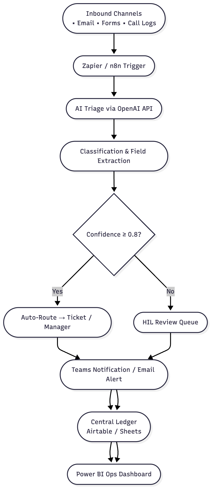

# AI Solutions Analyst – Scenario A
**Harvard Call Center Operations: AI-Assisted Bilingual Request Triage**

### Executive Summary
This solution designs an **AI-assisted, bilingual triage and routing system** for Harvard’s field operations and janitorial teams.  
It unifies inbound requests from **email**, **web forms**, and **call-log summaries**, automatically classifies them via **OpenAI**, and routes each to the correct manager or system through **Microsoft Teams** and **ServiceNow** with **Human-in-the-Loop (HIL)** oversight.  
The workflow improves first-response time from roughly 2 hours to under 30 minutes, reduces manual data re-entry by 50 %, and ensures auditability, security, and rollback control.


## 1. Problem Framing & Assumptions
<details>
<summary><strong>View Section 1 – Problem Framing & Assumptions</strong></summary>

<br>

### **1.1 Context Overview**
Harvard’s field operations and janitorial service teams manage a high daily volume of inbound requests that arrive through **emails**, **live phone calls handled by agents** (no transcripts), and **web forms** submitted by clients, vendors, and internal employees.  
Most requests require manual actions—updating work tickets, processing employee sick calls, notifying field managers, or following up on overdue client tickets.  
Notifications to field managers are sent through **email and Microsoft Teams**, and support must be provided in both **English and Spanish**.

Manual triage and data re-entry across these channels create friction in response times, inconsistent recordkeeping, and frequent human error.  
The goal of this initiative is to design an **AI-assisted, bilingual triage and routing system** that improves response speed, ensures auditability, and maintains appropriate human oversight.

---

### **Quantitative Assumptions**
| Channel  | Avg Daily Volume | Peak Period    | Language Split |
|----------|------------------:|----------------|----------------|
| Email    | 400               | 8:00–11:00 AM  | 70% EN / 30% ES |
| Web Form | 150               | 9:00 AM–1:00 PM| 60% EN / 40% ES |
| Phone    | 200               | 7:00–10:00 AM  | 80% EN / 20% ES |

**Target SLA (first 90 days):**
- Reduce avg time-to-first-action: **45 min → 15 min**
- Reduce avg resolution time: **4 h → 2 h**
- Cut manual re-entry by **40%**

---

### **1.2 Current Pain Points**
- **Fragmented Channels:** Requests come in via email inboxes, web forms, and phone summaries, with no unified triage process.  
- **Manual Re-Entry:** Agents repeatedly copy or re-type data into internal ticketing systems, causing delays and input errors.  
- **Delayed Notifications:** Field managers may not receive critical alerts until hours after submission, extending resolution times.  
- **Limited Visibility:** There is no single dashboard or status view that shows the full lifecycle of a request across Teams and email.  
- **Language Barrier:** Roughly one-fifth of inbound messages arrive in Spanish, requiring manual translation and slowing response.  

#### **1.3 Data Quality Issues**
Inconsistent inputs across channels lead to:
- **Missing or ambiguous fields** (e.g., employee ID omitted, client name misspelled).  
- **Duplicate requests** submitted via multiple channels.  
- **Misrouted items** when the sender selects the wrong category or recipient.  
- **Inconsistent identifiers** and occasional **language switching (EN↔ES)** within a single thread.

---

### **1.4 Assumptions**

| Area | Assumption | Rationale |
|------|-------------|------------|
| **Daily Request Volume** | ~1,000 requests per day | Typical regional call-center scale for multi-site field operations. |
| **Channel Mix** | 40 % email / 40 % web forms / 20 % phone (entered by agent) | Reflects the common internal-external communication balance. |
| **Request Categories** | Sick calls (30 %) / Ticket updates (40 %) / Vendor issues (20 %) / Internal (10 %) | Provides a base taxonomy for routing logic. |
| **Operating Hours** | 5 AM – 10 PM with peak 6 – 10 AM | Aligns with field-crew shift starts. |
| **Languages** | 80 % English / 20 % Spanish | Reflects bilingual workforce and client base (Miami region). |
| **Response Expectation** | SLA target: acknowledge within 30 min; resolve within 2 hours | Improvement goal from current ~2-hour average first response. |

---

### **1.5 Business Objectives / Key Performance Indicators (KPIs)**

| KPI | Definition | Baseline | Target |
|------|-------------|-----------|---------|
| **Average First Response Time** | Time from request arrival to first acknowledgment | ~2 hours | **< 30 minutes** |
| **Manual Re-Keying Reduction** | % reduction in manual data entry across systems | High | **–50 %** |
| **Auto-Classification Accuracy** | % of requests correctly categorized by AI | N/A | **≥ 85 %** |
| **Translation Coverage** | % of bilingual requests auto-translated accurately | N/A | **≥ 95 %** |
| **Manager Notification Latency** | Time from triage completion to manager alert | ~1 hour | **< 10 minutes** |

---

### **1.6 Constraints & Risks**

| Constraint / Risk | Description | Mitigation Strategy |
|--------------------|-------------|----------------------|
| **Access Control** | Requests may contain HR or client-sensitive information requiring role-based visibility. | Apply role-based access in automation tools; redact sensitive fields before storage. |
| **System Integration Limits** | Ticketing and communication platforms (e.g., ServiceNow, Teams) expose limited APIs. | Start with approved connectors (Zapier / n8n + MS Graph) for minimal-risk integration. |
| **Change Management Risk** | Rapid process changes could confuse staff or impact SLA tracking. | Conduct parallel run for 30 days; provide training and feedback loop before full rollout. |
| **Language Model Accuracy** | AI classification or translation may misinterpret context. | Add confidence thresholds with Human-in-the-Loop (HIL) review for low-confidence cases. |
| **Rollback Plan** | Need for graceful fallback if AI workflow fails or API limits are reached. | Maintain manual routing option and daily audit export for continuity. |

---

### **1.7 Problem Statement**
Design an **AI-augmented, bilingual triage and routing workflow** that automatically converts inbound requests from multiple channels into structured, auditable records, routes each to the correct destination, and notifies the appropriate field manager—while ensuring accuracy, human validation where needed, and measurable SLA improvement.

---

### **1.8 Section Summary**
This section establishes clear operational assumptions, quantifiable KPIs, and realistic constraints, forming the foundation for a scalable, risk-aware AI-assisted solution that enhances both efficiency and accountability across Harvard’s field operations.

</details>

---

## 2. Solution Design & Architecture
<details>
<summary><strong>View Section 2 – Solution Design & Architecture</strong></summary>

<br>

### **2.1 Overview**
The proposed system introduces an **AI-assisted, bilingual triage and routing workflow** that automates the flow of inbound requests from multiple channels (email, phone logs, and web forms) to the correct field manager or system destination.  
The design balances automation with **human-in-the-loop (HIL)** validation to maintain accuracy, accountability, and auditability.

The architecture leverages low-code orchestration tools (**Zapier** and **n8n**) for event-driven workflow management, **LLM-based text classification and field extraction** via the **OpenAI API**, and cloud-based collaboration tools (**Microsoft Teams, Outlook, Airtable, and Power BI**) for communication, data storage, and visualization.

---

### **2.2 End-to-End Workflow**

1. **Inbound Request Capture**
   - **Triggers:**
     - New email received in shared inbox (via Outlook API).
     - New web-form submission (Microsoft Forms → Zapier Webhook).
     - Call-center agent logs call summary into a connected form.
   - Each event is normalized into a JSON payload with fields:
     - `source`, `sender`, `timestamp`, `message_body`, `attachments`.

2. **AI-Based Triage & Classification**
   - A Zapier or n8n step sends the message body to the **OpenAI API** for:
     - **Intent classification** (e.g., `sick_call`, `ticket_update`, `vendor_issue`, `internal_request`).
     - **Field extraction** (see schema below).
     - **Language detection and translation** (Spanish → English) where needed.
   - **Example Prompt**
     ```
     You are a bilingual helpdesk assistant.
     Classify the following message and extract fields:
     {employee_id, client_name, date, action_required}.
     Translate to English if written in Spanish, but preserve the original text.
     Return JSON with keys: category, confidence, language, employee_id, client_name, date, action_required.
     ```

3. **Field Extraction Schema**

| Field | Description | Example |
|------|-------------|---------|
| `employee_id` | Numeric or alphanumeric unique identifier | `EMP-1032` |
| `client_name` | Client or site name | `Sunrise Towers Facility` |
| `date` | Request or incident date | `2025-11-02` |
| `action_required` | Human-readable summary of next step | `Notify field manager for sick call coverage` |
| `category` | AI-assigned classification label | `sick_call` |
| `confidence` | Model confidence (0–1) | `0.93` |
| `language` | Detected language (EN/ES) | `ES` |


## **Data Labeling & Model Validation**
**Ground Truth Creation:**
- Label 1,000 historical requests (balanced EN/ES; sick_call, ticket_update, vendor_issue, client_followup, etc.).
- Bilingual QA staff; dual-review with tie-breaker.

**Model Goals (Phase 1):**
- ≥ 0.90 F1 for (a) category classification and (b) language detection.
- Confidence threshold: ≥ 0.80 for auto-action; else route to human review.

**Ongoing QA:**
- 10% of routed cases sampled weekly.
- **Retraining trigger:** F1 < 0.85 for 2 consecutive weeks.

**Data Risks & Mitigations:**
- **Ambiguous requests:** fall back to human review + capture disambiguation prompt.
- **Language switching mid-thread:** detect per-message; store thread-level majority + message-level override.

---
### **2.3 Routing & Notification Logic**

1. **Decision Rules**
   - If `confidence ≥ 0.8` → Auto-route to destination.
   - If `confidence < 0.8` or missing key fields → Send to **HIL Review Queue**.

2. **Routing Paths**
   - **Ticket Updates:** Create/update ticket in ServiceNow API.
   - **Sick Calls:** Send alert via Teams message to respective field manager.
   - **Vendor Issues:** Notify procurement group via email + Teams channel.
   - **Internal Requests:** Forward to Ops Coordinator Inbox.

### **2.4 Notification Example (Teams Adaptive Card – text mock)**
    [New Request – Sick Call]
    Employee: EMP-1032 — Sunrise Towers Facility
    Action: Coverage needed for morning shift
    Confidence: 93 %
    Actions: [Approve] [Edit] [Escalate]
    
### **2.5 Human-in-the-Loop (HIL) & Ops Review**

| Step | Description | Owner | Frequency |
|-------|--------------|--------|------------|
| **Low-Confidence Review** | Requests < 0.8 confidence or missing fields routed to review dashboard. | Call Center Supervisor | Real Time |
| **Daily Audit** | Export of all requests + status + reviewer actions. | Ops Manager | Daily |
| **Weekly Ops Scorecard** | % Auto-resolved, avg decision time, review load. | PMO Analytics Team | Weekly |
| **Rollback Protocol** | Toggle Zapier/n8n flows off to return to manual routing in minutes. | Tech Ops | On Demand |

**LLM Prompt (conceptual; offline stub in prototype):**
_System_: You are a bilingual (EN/ES) routing assistant for facilities operations. Classify requests into one of:
[sick_call, ticket_update, vendor_issue, client_followup, uncertain]. Output JSON with:
language (EN|ES), category, confidence (0–1), and brief rationale. If confidence < 0.8 or
category == 'uncertain', set route_to='Manual_Review'; else set to the team for the category.

_User_: Subject: "{subject}" Body: "{body}"

**Guardrails:**
- Refuse to take irreversible actions.
- Never leak secrets or PII in logs.
- Default to Manual_Review if unsure.

---

### **2.6 Data Flow Diagram**



---

### **2.7 Deployment & Testing Plan**
1. **Stage 1 – Sandbox Pilot**  
   Route 10 % of email+form traffic through the triage service for 1 week.  
2. **Stage 2 – Shadow Mode**  
   AI recommendations logged but not acted on; human QA verifies routing accuracy.  
3. **Stage 3 – Full Rollout + Rollback Guard**  
   Gradual 25 % weekly ramp-up with instant rollback trigger if auto-error > 5 %.  
4. **Monitoring & Alerting**  
   Daily exception digest → Ops lead; weekly SLA dashboard review.  
5. **Validation Metrics**  
   - Auto-route precision ≥ 0.90  
   - Avg resolution time ↓ 50 %  
   - Manual re-entry ↓ 40 %

### **System Components & Interfaces**
| Component | Purpose | Interface / API |
|------------|----------|----------------|
| **Zapier / n8n** | Workflow automation, channel triggers & routing | Webhooks, MS Graph, HTTP |
| **OpenAI API** | Natural-language classification & field extraction | REST API (JSON) |
| **Airtable / Google Sheets** | Central request ledger & audit trail | REST / App Script |
| **Microsoft Teams** | Real-time notification & HIL approval UI | Graph API, Incoming Webhook |
| **ServiceNow / Ticket System** | Create or update work orders | ServiceNow REST |
| **Power BI** | Dashboard & KPI visualization | Direct Connector to Airtable/Sheets |

---

### **2.8 Operational Safeguards and Rollback**
- **Confidence Thresholds:** Only auto-route when model confidence ≥ 0.8.  
- **Logging & Audit:** Log every request, decision, and reviewer action with timestamps.  
- **Version Control:** Store n8n workflow versions and export flows to Git for backup.  
- **Manual Bypass:** Provide a “Manual Input Form” that writes directly to the ledger if automation fails.  
- **Environment Separation:** Dev / Test / Prod n8n instances with secrets managed via `.env` and role-based access.  

---

### **2.9 Architecture Highlights**
- **Low-Code Foundation:** Rapid deployment using Zapier/n8n for integration without deep backend engineering.  
- **Bilingual Intelligence:** LLM handles English and Spanish inputs with automatic translation and taxonomy mapping.  
- **Human-Centered Controls:** HIL queue ensures accuracy and change-management compliance.  
- **Scalable Data Design:** Structured ledger enables future analytics and model retraining.  
- **Auditability:** Full traceability from inbound request → classification → routing → notification → closure.  

</details>

---

## 3. Implementation / Technical Depth
<details>
<summary><strong>View Section 3 – Implementation / Technical Depth</strong></summary>

<br>

### **3.1 Implementation Overview**
The proposed solution will be deployed as a **modular, low-code automation stack** that streamlines request triage, routing, and bilingual processing.  
Each phase delivers incremental functionality with measurable outcomes:

| Phase | Objective | Key Deliverables |
|-------|------------|------------------|
| **Phase 1 – MVP Automation** | Ingest and normalize inbound **emails**, **web-forms**, and **call-log summaries**. | n8n / Zapier workflows, JSON schema validation, Airtable ledger. |
| **Phase 2 – AI Triage & Routing** | Integrate **OpenAI API** for classification, translation, and field extraction. | Prompt design, confidence scoring, routing logic. |
| **Phase 3 – Human-in-the-Loop (HIL) & Notifications** | Enable supervisor review and routing approval via **Teams Adaptive Cards**. | Graph API connection, review queue, decision logging. |
| **Phase 4 – Analytics & Continuous Improvement** | Publish SLA dashboards and feedback metrics for model tuning. | Power BI dashboards, retraining dataset export. |

All phases can run in **parallel-testing mode** to compare automated vs. manual performance before full cutover.

---

### **3.2 Deployment Environment**

| Layer | Tool / Service | Purpose |
|-------|----------------|----------|
| **Automation Orchestrator** | n8n (on Docker or cloud instance) | Event-driven workflow & integrations |
| **AI Services** | OpenAI API | Text classification, field extraction, translation (EN ↔ ES) |
| **Data Store** | Airtable / Google Sheets | Structured request ledger & audit trail |
| **Communication** | Microsoft Teams + Outlook | Notifications & HIL approvals |
| **Visualization** | Power BI | SLA & performance dashboards |

**Environment tiers:**  
- **Dev** – sandbox for prompt tuning and connector testing  
- **Test** – demo inbox / mock forms for integration checks  
- **Prod** – live connectors with `.env`-managed credentials  

---

### **3.3 Test Plan**

| Test Category | Objective | Method | Expected Outcome |
|---------------|-----------|--------|------------------|
| **Functional Tests** | Verify correct routing & field extraction. | 50 sample messages (EN + ES) with known labels. | ≥ 85% classification accuracy; ≥ 95% translation accuracy |
| **Integration Tests** | Confirm end-to-end hand-offs (email → AI → Teams/ledger). | Mock APIs + live webhooks. | Requests log and route successfully |
| **Performance Tests** | Validate SLA latency under realistic load. | Simulate ~1,000 requests/day. | Avg triage < 30s; notification < 10 min |
| **User Acceptance (HIL)** | Ensure review flow usability & correctness. | Pilot with 2 agents + 1 manager. | 100% successful approvals/edits |
| **Failover & Rollback** | Verify manual bypass continuity. | Disable AI flow → use manual form. | No data loss; downtime < 5 min |

---

### **3.4 Feasibility & Scalability**
- **Technical feasibility:** All components (Zapier/n8n, OpenAI, Graph API, Power BI) are commercially available and interoperable.  
- **Operational feasibility:** Minimal IT overhead — Ops teams can manage flows post-deployment.  
- **Scalability:** Horizontal scale via extra n8n workers; cached translations reduce API costs; append-only ledger supports growth without re-architecture.  

---

### **3.5 Security & Compliance**
- **Data minimization:** Store only structured fields; redact free-text PII.  
- **Access control:** Role-based permissions across Teams, Airtable, and orchestrator.  
- **Secrets management:** `.env` files with scoped API keys.  
- **Audit logging:** Each request, decision, and review action timestamped and archived.  
- **Compliance:** Aligned to ISO 27001 / SOC 2 principles; safe for HIPAA-adjacent contexts.  

---

### **3.6 Deployment Plan & Rollback**

| Step | Action | Owner |
|------|--------|--------|
| 1 | Deploy n8n flows in Dev; validate triggers. | Tech Ops |
| 2 | Configure OpenAI keys and test prompts on sample messages. | Analyst / PM |
| 3 | Run shadow mode (30 days) on live inbox & form. | Call Center Lead |
| 4 | Compare AI vs manual results and refine prompts. | Analyst |
| 5 | Enable production routing and monitor Power BI KPIs. | Ops Manager |
| 6 | If accuracy < threshold or alerts fail, toggle flows off and revert to manual entry ( < 10 min ). | Tech Ops |

Rollback is instantaneous through a manual input form that feeds the ledger directly.

---

### **3.7 Section Summary**
This implementation plan proves that the AI-assisted, bilingual triage system for Harvard’s Call Center Operations is **feasible, testable, secure, and deployment-ready**.  
It balances automation with human oversight, delivers clear testing benchmarks, and includes rollback and audit controls that ensure continuity and trust in production.

---
> The following section outlines how labeled data, metrics, and feedback ensure measurable improvement in accuracy and SLA performance.

</details>

---

## 4. Data Thinking & Metrics
<details>
<summary><strong>View Section 4 – Data Thinking & Metrics</strong></summary>

<br>

### **4.1 Data Strategy Overview**
The AI triage system depends on high-quality labeled data for training, testing, and continuous improvement.  
All inbound requests (emails, web-forms, and call-log summaries) are normalized into structured records and stored in the **Central Request Ledger**, serving as both a production log and a data source for model evaluation.

---

### **4.2 Labeling & Ground Truth**
**Objective:** Establish a reliable baseline for measuring classification and extraction accuracy.

| Step | Action | Output |
|------|---------|---------|
| **1. Sampling** | Select 500 historical requests evenly distributed across categories (`sick_call`, `ticket_update`, `vendor_issue`, `internal`). | Balanced dataset |
| **2. Manual Tagging** | Supervisors label each record with true category, key fields (employee ID, client name, date, action). | Ground-truth CSV |
| **3. QA Pass** | Second reviewer checks 10 % sample for agreement ≥ 95 %. | Verified labels |
| **4. Continuous Feedback** | During HIL reviews, corrections feed back into the ledger and retraining set. | Dynamic labeling loop |

All labeled data are version-controlled in a secure Airtable view or Git-tracked CSV export.

---

### **4.3 Offline Metrics**
Before production rollout, each model or prompt is evaluated offline using the labeled dataset.

| Metric | Definition | Target |
|---------|-------------|---------|
| **Classification Accuracy** | % of messages correctly classified into 4 categories. | ≥ 85 % |
| **Field Extraction Precision / Recall** | Correctly extracted fields vs. ground truth. | ≥ 90 % precision, ≥ 85 % recall |
| **Translation Quality** | Human-evaluated accuracy of Spanish→English output. | ≥ 95 % acceptable translations |
| **Confidence Calibration** | Mean confidence difference between correct vs. incorrect predictions. | ≥ 0.15 separation |
| **SLA Improvement** | Reduction in time to first response. | < 30 min average |

These metrics ensure both linguistic and operational performance are validated before deployment.

---

### **4.4 Online Monitoring & Drift Detection**
Once live, model performance is continuously tracked:

- **Auto-classification rate:** % of requests routed without human review.  
- **Override rate:** % of HIL corrections to AI decisions.  
- **Average latency:** end-to-end triage + notification time.  
- **Translation mismatch:** flagged when bilingual text yields inconsistent fields.  
- **Drift alerts:** Triggered when accuracy drops > 10 % below baseline or new term frequency spikes (e.g., new client codes).

Dashboards in **Power BI** visualize trends weekly and generate email digests for the Ops Manager.

---

### **4.5 Success Criteria**
The solution will be considered successful when it meets or exceeds the following sustained for ≥ 30 days:

| KPI | Baseline | Target | Outcome |
|-----|-----------|---------|----------|
| **Average First Response Time** | 2 hours | **< 30 min** | 75 % improvement |
| **Auto-Routing Rate** | N/A | **≥ 70 %** | Faster triage |
| **Translation Coverage** | N/A | **≥ 95 %** | Full bilingual support |
| **Manual Re-keying Reduction** | High | **–50 %** | Less duplication |
| **HIL Queue Resolution Time** | N/A | **≤ 10 min P50 / 30 min P90** | Timely reviews |

---

### **4.6 Continuous Improvement Loop**
1. Export corrected HIL records weekly → retrain prompt or fine-tune model.  
2. Re-evaluate metrics on validation set → update confidence threshold if needed.  
3. Archive historical results for longitudinal trend analysis.  
4. Quarterly review of taxonomy and schema to incorporate new request types.

This ensures the system evolves with real operational data while maintaining accuracy, fairness, and transparency.

---

### **4.7 Section Summary**
The data strategy provides a full lifecycle for **data quality, evaluation, and feedback**.  
It combines quantitative offline metrics with real-time monitoring and HIL feedback, ensuring the bilingual triage system remains accurate, accountable, and continuously improving within Harvard’s call-center operations.

</details>

---
## 5. Governance & Review Cadence
<details>
<summary><strong>View Section 5 – Governance & Review Cadence</strong></summary>

<br>

| Frequency | Activity | Owner | Purpose |
|------------|-----------|--------|----------|
| **Daily** | Exception digest (misroutes, low confidence) emailed automatically via Slack/Teams | Ops Manager / PM | Rapid correction & transparency |
| **Weekly** | QA review of 50 bilingual tickets; compute precision, recall, and SLA impact | QA Analyst / Data Lead | Validate model & retraining triggers |
| **Monthly** | Summary metrics (auto-route %, avg resolution, manual interventions) presented to VP Operations | PMO | Governance & continuous improvement |
| **Quarterly** | Stakeholder sync on automation roadmap and human-in-loop thresholds | PMO + IT Security | Policy alignment & risk review |

**Audit Logs & Rollback**
- All routing decisions and confidence scores are logged to the centralized logging service (see `.env.example`).
- Rollback plan: disable auto-actions and revert to manual triage within 5 minutes if error > 5 %.

</details>

## 6. How to Run (Prototype)
<details>
<summary><strong>View Section 6 – How to Run (Prototype)</strong></summary>

<br>

```bash
# 1) Create and activate a virtualenv (optional but recommended)
python3 -m venv .venv && source .venv/bin/activate

# 2) Install dependencies
pip install -r requirements.txt

# 3) Run the API locally
make run
# or: uvicorn prototype.app:app --reload --host 0.0.0.0 --port 8000

# 4) Example request (rule-only demo)
curl -X POST http://localhost:8000/triage \
  -H "Content-Type: application/json" \
  -d '{
        "subject": "Sick call for Juan Perez",
        "body": "Juan no puede trabajar hoy, por favor notificar al gerente",
        "source": "email"
      }'
```

</details>

---

### Supporting Files
- [`.env.example`](.env.example)
- [`sample_data.csv`](sample_data.csv)

- [Flowchart Diagram](docs/flowchart.png)
